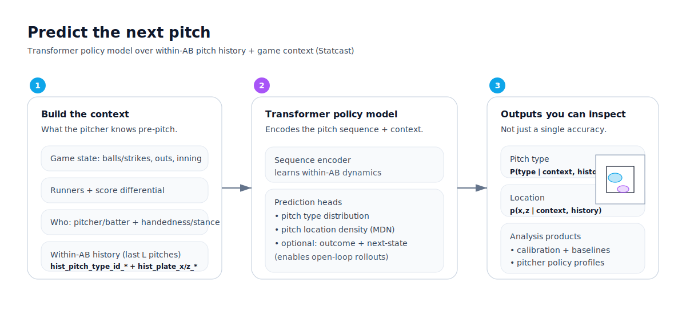
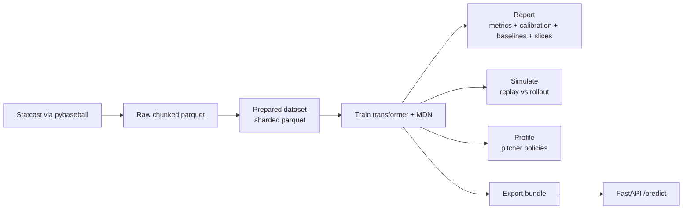
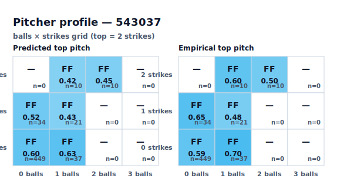
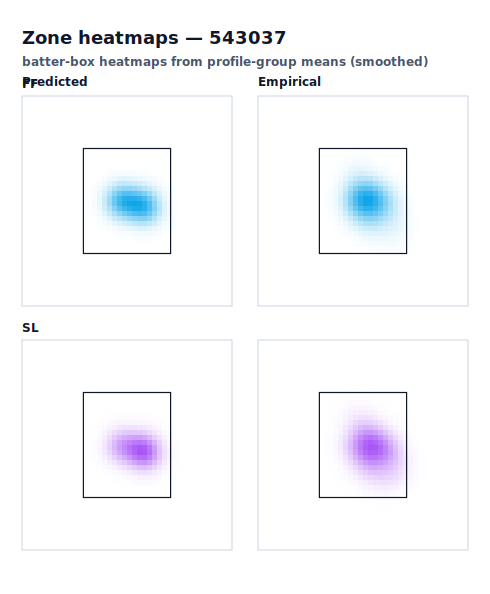
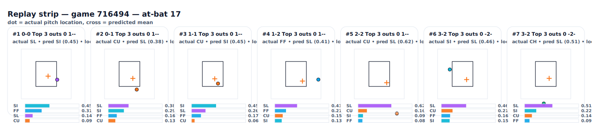

# Baseball Pitch Model

Transformer-first modeling of **what pitch gets thrown next**.

At each pitch, the model predicts:
- **Pitch type** as a probability distribution (classification)
- **Pitch location** as a probability density over the batter box (probabilistic regression via a 2D mixture model)

Those predictions are conditioned on:
- within‑AB pitch history (types + locations, optionally outcomes),
- pre‑pitch game state (count / outs / runners / score / inning),
- pitcher/batter identity + handedness/stance.

## How to read this project (3 levels of “inspectability”)

This repo is built around the idea that pitch prediction is a **policy modeling** problem:
you want a model you can interrogate, not just a single accuracy number.

There are three complementary “views”:

1) **Pitcher policy view** (aggregate): “What does this pitcher throw in this situation?”
2) **At-bat replay view** (granular): “Pitch-by-pitch, what did the model think would happen next?”
3) **Game simulation view** (distribution shift): “How does the model behave when it runs forward open‑loop?”

## A quick tour (what’s in the repo)

You can:
- train transformer models on large Statcast datasets (streaming parquet; GPU-friendly),
- generate writeup-ready reports (calibration + slice metrics + strong empirical baselines),
- run open‑loop rollouts on held‑out games to measure drift,
- generate **pitch‑by‑pitch JSONL traces** for replay/rollout (for debugging and storytelling),
- build pitcher “policy tables” (what a pitcher throws next by count/situation),
- export bundles + serve predictions via FastAPI.

## What’s unique here

- **Sequence policy modeling**: the transformer learns “AB context”, not just pitcher priors.
- **Probabilistic location**: location is scored with `loc_nll` (proper scoring rule), not only RMSE.
- **Open-loop rollouts**: the repo can simulate held-out games to study drift (`replay` vs `rollout`).
- **Pitch-by-pitch replay traces**: emit per‑pitch top‑K probabilities + location scores for a single game.
- **Pitcher policies**: export per-pitcher conditional “what do they throw next in this situation?” tables.
- **Writeup-ready evaluation**: calibration + slice metrics + strong empirical baselines.

## Pipeline (end-to-end)

## Results snapshot (example run)

One strong 2023-only run (`final_state_mt_4665878`, valid, teacher-forced):

| Metric | Value |
|---|---:|
| Pitch type top‑1 | 0.478 |
| Pitch type top‑3 | 0.897 |
| Location RMSE (ft) | 0.875 |
| Calibration ECE (15 bins) | 0.041 |

Quick definitions:
- **top‑1**: the most likely pitch type matches the true pitch type.
- **top‑3**: the true pitch type is anywhere in the model’s 3 most likely types.
- **`loc_nll`** (in traces): per‑pitch negative log likelihood under the predicted location density (lower is better).

Open-loop rollouts (50 held-out games) predictably drop due to drift:
| Setting | Top‑1 | Top‑3 |
|---|---:|---:|
| rollout (heads) | 0.402 | 0.830 |
| rollout (clamp count) | 0.403 | 0.835 |

## Pitcher profile example (the “policy view”)

Example pitcher: **Gerrit Cole** (MLBAM `543037`).

Count-policy heatmap: for each count (balls × strikes), show the **top pitch type** and its probability.
- left = model prediction
- right = empirical distribution from the dataset

Zone heatmaps: batter‑box location density for specific pitch types (here: FF + SL).
- left = predicted location density
- right = empirical location density

## Pitch-by-pitch replay (the “at-bat view”)

Aggregate pitcher profiles are useful, but sometimes you want to see the model *think*.
This repo can emit a pitch-by-pitch JSONL trace for a single held‑out game, then render it as a compact replay strip.

Each pitch panel shows:
- the pre‑pitch state (count / inning / bases),
- the model’s top pitch-type probabilities,
- actual location (dot) vs predicted mean (cross),
- per‑pitch `loc_nll`.

## Replay vs rollout (the “simulation view”)

- **Replay** = teacher-forced (uses true pre‑pitch state every step).
- **Rollout** = open-loop (feeds the model’s predicted next state into the next pitch).

Rollouts are where you see distribution shift: errors compound and accuracy drops. That’s expected — and measurable.

## Docs

- Start here: `docs/README.md`
- Setup: `docs/setup.md`
- Greene workflows: `docs/workflows-greene.md`
- Simulation + replay traces: `docs/simulation.md`
- Visual generation: `docs/visuals.md`
- Narrative writeup: `docs/writeup.md`
