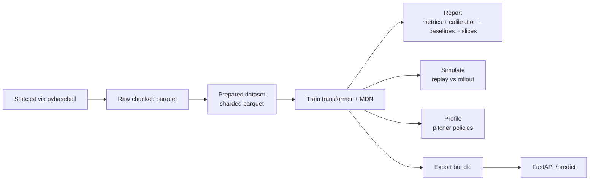

# Baseball Pitch Model

Transformer-first modeling of **what pitch gets thrown next**:

- **Pitch type** (classification)
- **Pitch location** (probabilistic density via a 2D mixture model)

Conditioned on:
- within-AB pitch history (types + locations, optionally outcomes),
- pre-pitch game state (count / outs / runners / score / inning),
- pitcher/batter identity + handedness/stance.

## What’s unique here

- **Sequence policy modeling**: the transformer learns “AB context”, not just pitcher priors.
- **Probabilistic location**: location is scored with `loc_nll` (proper scoring rule), not only RMSE.
- **Open-loop rollouts**: the repo can simulate held-out games to study drift (`replay` vs `rollout`).
- **Pitcher policies**: export per-pitcher conditional “what do they throw next in this situation?” tables.
- **Writeup-ready evaluation**: calibration + slice metrics + strong empirical baselines.

## Pipeline (end-to-end)

## Results snapshot (example run)

One strong 2023-only run (`final_state_mt_4665878`, valid, teacher-forced):

| Metric | Value |
|---|---:|
| Pitch type top‑1 | 0.478 |
| Pitch type top‑3 | 0.897 |
| Location RMSE (ft) | 0.875 |
| Calibration ECE (15 bins) | 0.041 |

Open-loop rollouts (50 held-out games) predictably drop due to drift:
| Setting | Top‑1 | Top‑3 |
|---|---:|---:|
| rollout (heads) | 0.402 | 0.830 |
| rollout (clamp count) | 0.403 | 0.835 |

## Docs

- Start here: `docs/README.md`
- Setup: `docs/setup.md`
- Greene workflows: `docs/workflows-greene.md`
- Narrative writeup: `docs/writeup.md`
